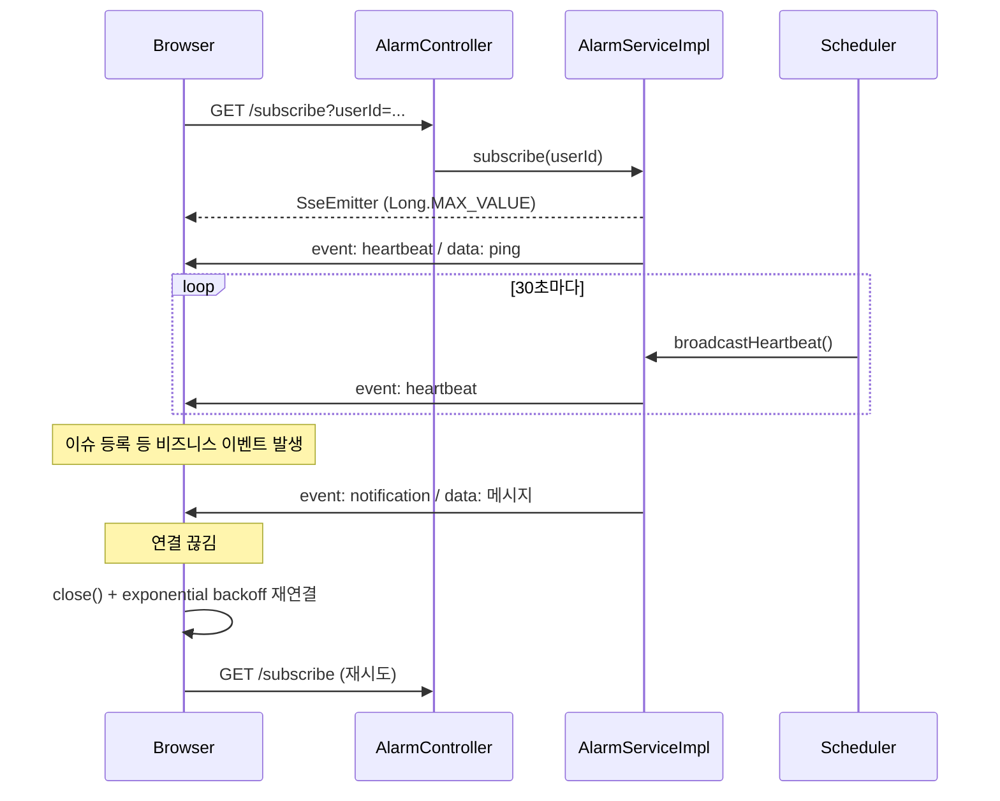

# 실시간 알림(SSE) 가이드

로그인 사용자에게 **Server-Sent Events(SSE)** 로 알림을 push하는 모듈입니다.  
navbar가 포함된 모든 레이아웃(`defaultLayout`, `projectLayout`, `errorpgLayout`)에서 자동으로 연결됩니다.

---

## 1. 구성 요소

| 구분 | 경로 |
|------|------|
| Controller | `com.example.demo.alarm.controller.AlarmController` |
| Service | `com.example.demo.alarm.service.AlarmService` |
| Service 구현 | `com.example.demo.alarm.service.impl.AlarmServiceImpl` |
| 이벤트 리스너 | `com.example.demo.alarm.event.NotificationEventListener` |
| 스케줄러 | `com.example.demo.alarm.scheduler.NotificationScheduler` |
| 클라이언트 | `src/main/resources/templates/layout/fragments/navbar.html` |

### API

| Method | URL | 설명 |
|--------|-----|------|
| `GET` | `/api/notifications/subscribe?userId={userId}` | SSE 구독 (응답: `text/event-stream`) |

### 보안 설정

`WebSecurityConfig`에서 `/api/notifications/**`는 `permitAll`입니다.  
`userId` 쿼리 파라미터로 연결하므로, 운영 환경에서는 인증·세션 검증 강화를 검토하는 것이 좋습니다.

### 관련 설정 (`application.properties`)

```properties
spring.mvc.async.request-timeout=-1
```

비동기 SSE 요청 타임아웃을 비활성화합니다.

애플리케이션 메인 클래스:

```java
@EnableScheduling  // heartbeat 스케줄러
@EnableAsync       // NotificationEventListener 비동기 처리
```

---

## 2. 동작 흐름



---

## 3. SSE 이벤트 종류

| 이벤트명 | 발신 시점 | 클라이언트 처리 |
|----------|-----------|-----------------|
| `heartbeat` | 연결 직후 + 30초 주기 | UI 변경 없음, 연결 유지·재연결 카운터 리셋 |
| `notification` | 알림 발생 시 | navbar 알림 목록·뱃지·브라우저 Notification |

### 서버 전송 형식 예시

```
event: heartbeat
data: ping

event: notification
data: 이슈가 등록되었습니다: ...
```

---

## 4. Heartbeat (서버)

### 목적

알림이 없는 동안 SSE 연결이 **idle** 상태로 오래 유지되면, 프록시·로드밸런서·방화벽 등이 연결을 끊을 수 있습니다.  
주기적으로 `heartbeat` 이벤트를 보내 **“연결이 살아 있음”** 을 알립니다.

### 구현 (`AlarmServiceImpl`)

| 항목 | 값 |
|------|-----|
| 주기 | 30초 (`HEARTBEAT_INTERVAL_MS = 30_000`) |
| 스케줄 | `@Scheduled(fixedRate = 30_000)` → `broadcastHeartbeat()` |
| 연결 직후 | `subscribe()`에서 `sendHeartbeat()` 1회 즉시 전송 |

### 연결 관리

- `userId`를 키로 `ConcurrentHashMap`에 `SseEmitter` 저장
- 같은 `userId`로 재구독 시 **이전 emitter를 `complete()`** 후 교체
- 종료 시 `emitters.remove(userId, emitter)`로 **해당 인스턴스만** 제거 (다른 탭/연결과 혼동 방지)

---

## 5. Exponential Backoff 재연결 (클라이언트)

### 목적

`EventSource`는 기본적으로 `onerror` 시 **브라우저가 즉시 재연결**을 시도합니다.  
연결이 불안정하면 `/subscribe` 요청이 짧은 간격으로 반복되어 서버 부하·응답 지연(핑 스파이크)을 유발할 수 있습니다.

### 구현 (`navbar.html`)

| 상수 | 값 | 설명 |
|------|-----|------|
| `SSE_BASE_DELAY_MS` | `1000` | 첫 재시도 대기 (1초) |
| `SSE_MAX_DELAY_MS` | `60000` | 대기 상한 (60초) |
| `SSE_MAX_ATTEMPTS` | `12` | 재연결 최대 횟수 |

### 대기 시간 계산

```
delay = min(60000, 1000 × 2^reconnectAttempt)
```

| 시도 | 대기(ms) |
|------|----------|
| 1 | 1,000 |
| 2 | 2,000 |
| 3 | 4,000 |
| 4 | 8,000 |
| … | … |
| 6 이후 | 60,000 (상한) |

### 재연결 절차

1. `onerror` → `eventSource.close()` (브라우저 자동 재연결 차단)
2. `scheduleReconnect()` → 위 backoff 후 `connectSse()` 호출
3. `open` 또는 `heartbeat` 수신 시 → `resetReconnectState()` (카운터·타이머 초기화)
4. `beforeunload` → 연결·타이머 정리

### 최대 횟수 초과 시

콘솔에 아래 메시지가 출력되고, **자동 재연결은 중단**됩니다.  
페이지 새로고침 시 `connectSse()`가 다시 실행됩니다.

```
SSE 재연결 최대 횟수 초과. 알림 실시간 수신이 중단되었습니다.
```

---

## 6. 알림이 발생하는 경로

### 6.1 Spring 이벤트 (`NotificationEvent`)

| 발생 위치 | 예시 메시지 |
|-----------|-------------|
| `IssueServiceImpl` | 이슈 등록·상태 변경 |
| `ProjectServiceImpl` | 프로젝트·그룹 관련 |

`NotificationEventListener`가 `@Async`로 `alarmService.sendToAll(message)` 호출.

### 6.2 스케줄러 (`NotificationScheduler`)

| 항목 | 값 |
|------|-----|
| 주기 | `fixedRate = 6_000_000` ms (약 100분) |
| 조건 | 1시간 후 시작하는 일정 |
| 동작 | `sendToAll("1시간 후 일정이 시작됩니다: ...")` |

> 1분 주기가 필요하면 `60000`으로 변경 여부를 검토하세요. (`6000000`은 100분입니다.)

---

## 7. 운영·트러블슈팅

### 7.1 DevTools로 확인

1. **Network** 탭에서 `/api/notifications/subscribe` 요청이 **pending** 상태인지 확인
2. **EventStream** 또는 응답 본문에서 약 30초마다 `heartbeat` 이벤트 수신 여부 확인
3. 연결 끊김 시 콘솔: `SSE 연결 끊김. N초 후 재연결 (시도/12)` 메시지 확인

### 7.2 증상별 원인

| 증상 | 가능 원인 | 확인 |
|------|-----------|------|
| 전 페이지에서 주기적 지연 | idle SSE 끊김 → 재연결 폭주 | heartbeat 수신·subscribe 반복 빈도 |
| 알림이 안 옴 | 재연결 12회 초과 후 중단 | 콘솔 경고, 새로고침 |
| 탭 여러 개 | 동일 `userId`로 마지막 탭만 유효 | 이전 탭 emitter `complete()` |
| 간헐적 전체 느림 | DB 커넥션 풀(기본 10) + SSE·권한 조회 경합 | Hikari·동시 접속 수 |

### 7.3 튜닝 포인트

| 위치 | 변경 대상 |
|------|-----------|
| `AlarmServiceImpl.HEARTBEAT_INTERVAL_MS` | heartbeat 주기 (기본 30초) |
| `navbar.html` `SSE_*` 상수 | backoff·최대 재시도 |
| `NotificationScheduler` `@Scheduled` | 일정 알림 주기 |
| `application.properties` `hikari.maximum-pool-size` | DB 풀 (SSE와 무관하지만 스파이크 완화) |

---

## 8. 향후 개선 제안 (미구현)

| 항목 | 설명 |
|------|------|
| 연결 ID 분리 | `userId` 대신 `connectionId`(UUID)로 탭별 독립 연결 |
| 인증 강화 | 세션·JWT 검증 후 subscribe 허용 |
| 권한 메뉴 캐시 | `ProjectAuthorizationManager`의 매 요청 DB 조회 캐시 |
| `sendToUser` 활용 | 전체 브로드캐스트 대신 대상 사용자만 전송 |

---

## 9. 변경 이력

| 날짜 | 내용 |
|------|------|
| 2026-05-29 | SSE heartbeat(30초) 및 클라이언트 exponential backoff 재연결 적용 |
